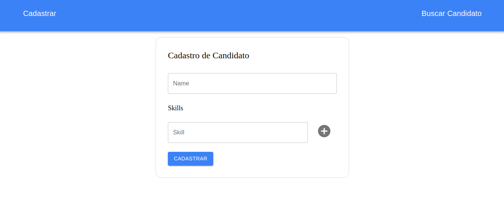

# Cadastro e Busca de Candidatos | Teste Catho

O teste realizado tem como foco a implementação de uma API que permita a adição de candidatos e a busca dos mesmos conforme o filtro de skills aplicado afim de se encontrar a melhor pessoa para um trabalho com base em suas habilidades.
As Requisições utilizadas são POST(para a adição de candidatos) e GET(para retorno do melhor candidato de acordo com o número de habilidades correspondentes). 

Na parte do Front utilizei Next.js para criar uma interface básica que interaja com a API. A aplicação conta com uma página para cadastrar candidatos e adicionar novas habilidades, bem como uma página para buscr candidatos com base nas habilidades e exibir os resultados.

 

  

## 📁 Acesso ao projeto

**Para executar esse projeto é necessário instalar algumas dependências e seguir alguns passos disponibilizados nas pastas respectivas de cada parte do projeto. Inicialmente siga:**
 
Você pode clonar este repositório através de seu terminal ou baixá-lo aqui mesmo.

## 🛠️ Abrir e rodar o projeto

- Abra seu editor de código
- Solicite para abrir o arquivo 
- Procure o local onde o projeto está e o selecione (Caso o projeto seja baixado via .zip, é necessário extraí-lo antes de procurá-lo)
- Clique em Abrir
- Para rodar o projeto certifique-se de ter instalado em sua máquina o NodeJs

## Stack utilizada

      

